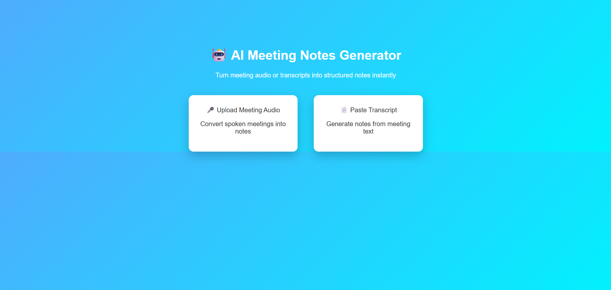
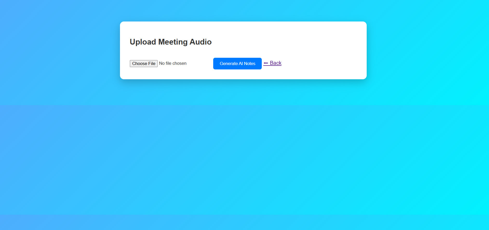
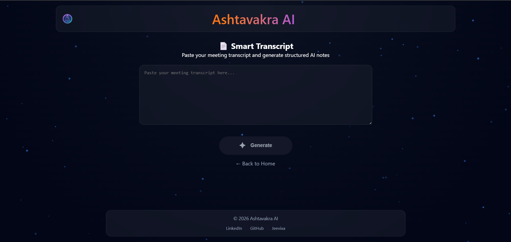
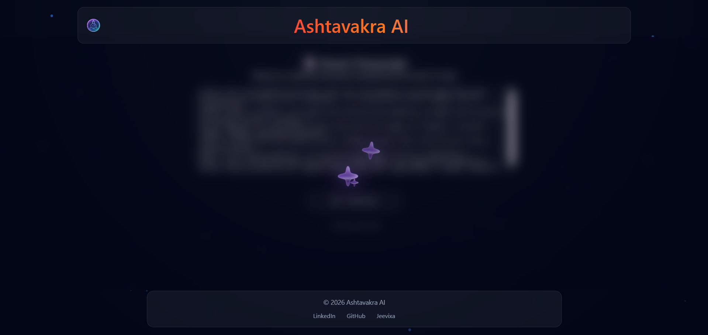
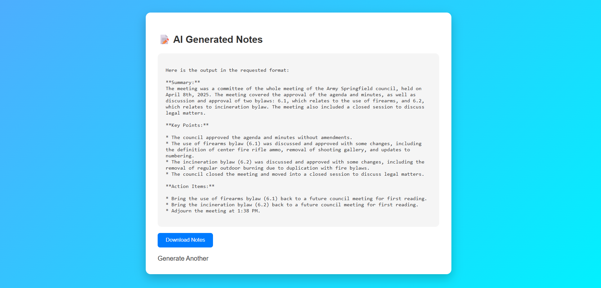
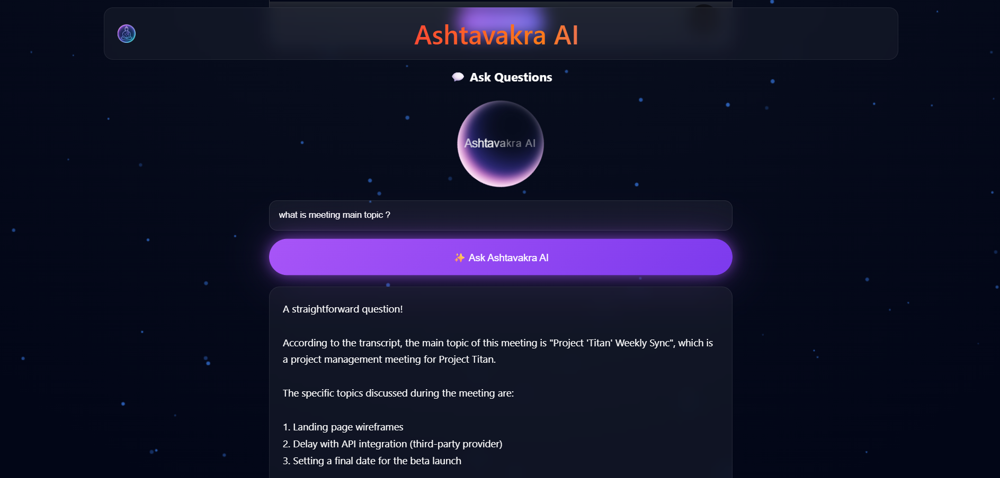

# 🤖 Ashtavakra AI – Meeting Notes Generator

AI-powered web app that converts meeting audio or transcripts into structured notes using **Whisper** and **Llama3 (Ollama)**.

---

## 🚀 Features

- Convert audio → text using Whisper  
- Generate structured notes:
  - Summary  
  - Key Points  
  - Action Items  
- Ask questions from generated notes  
- Fully local AI (no paid APIs)  
- Clean and simple UI  

---

## 🧠 Workflow

Audio / Transcript  
↓  
Whisper (Speech-to-Text)  
↓  
Transcript  
↓  
Llama3 (Ollama)  
↓  
Structured Notes  

---

## 🛠 Tech Stack

- Frontend: HTML, CSS, JavaScript  
- Backend: FastAPI  
- Speech-to-Text: Whisper  
- LLM: Llama3 (Ollama)  
- Audio: FFmpeg  

---

## 📸 Screenshots

  
  
  
  
  
  

---

## ⚙️ Setup

```bash
git clone https://github.com/DarshanPatel2006/AI-Meeting-Notes-Generator.git
cd AI-Meeting-Notes-Generator

python -m venv venv
venv\Scripts\activate

pip install -r requirements.txt

ollama run llama3
uvicorn backend.main:app --reload

Open:
http://localhost:8000/

📌 Future Improvements
Speaker identification
Real-time transcription
RAG-based search
Export to PDF
```
## 👨‍💻 Author

### Darshan Patel

## ⭐ Support
```
If you found this project useful, consider giving it a ⭐ on GitHub!
```
